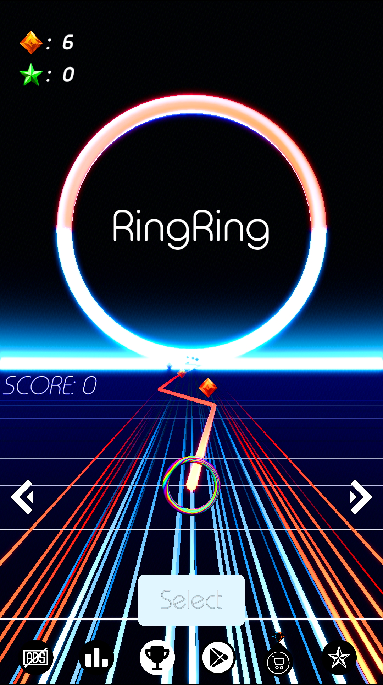
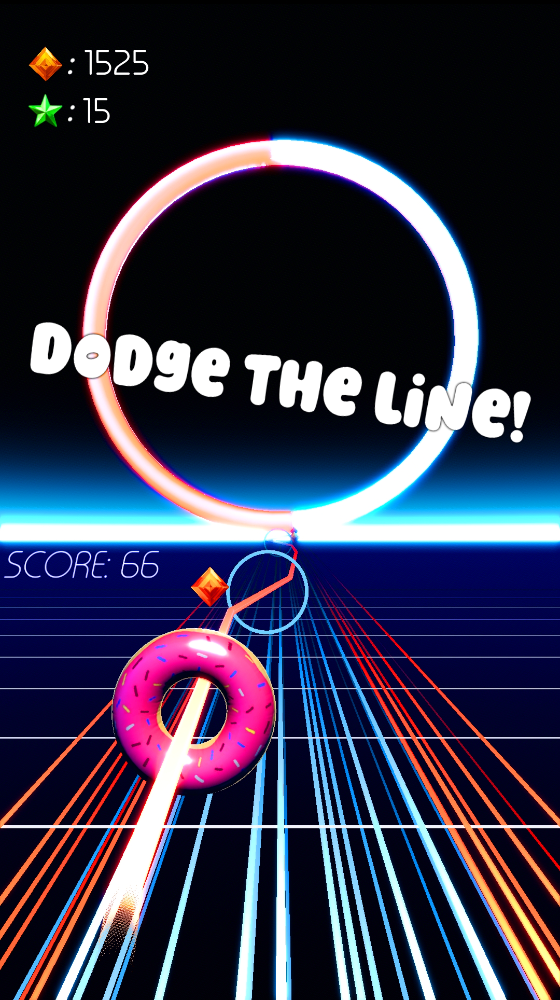
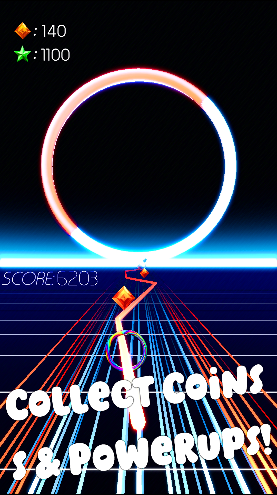
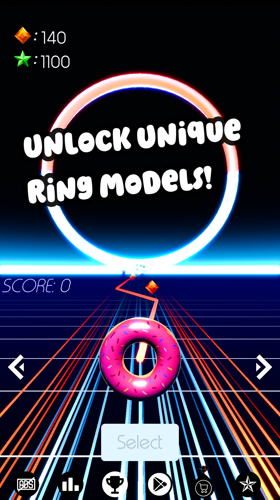

# RingRing

Welcome to the **RingRing** project repository! This repository contains the **source code** for the game RingRing. Please read the following information carefully to understand what is included and how to proceed.

---

## 📁 Repository Contents

This repository includes:
- **Source code** for the RingRing project.
- Necessary scripts and configuration files for development.

### 🚫 What's Not Included
For size and licensing reasons, the following files are **not included** in this repository:
- **Materials**: Textures, shaders, and other graphical assets.
- **Meshes**: 3D models and related files.
- **Scenes**: Preconfigured scenes used in the project.
- **Fonts**: Custom fonts used in the application.
- **Project File**: The main project file for the development environment.

---

## 🚀 Download the Compiled Application

If you're looking to use the RingRing application without building it from source, you can download the **compiled release** from the [Releases](https://github.com/your-username/RingRing/releases) section. Two versions are available:

1. **Android**: The app is primarily intended for Android devices.
2. **Windows**: A Windows version is also provided, but with limited functionality.

### Platform-Specific Features
- **Android**: Most features (saving, achievements, transactions, leaderboard, ads) should work. However, if they don't, you may need to be approved as a tester for the project in the Google Play Console. If you encounter issues, please email me so I can add you as a tester.
- **Windows**: Certain features (saving, achievements, transactions, leaderboard, ads) **will not work** on Windows. The Windows version is provided for testing and demonstration purposes only, however core game mechanics are functional.

### Steps to Download:
1. Go to the [Releases](https://github.com/your-username/RingRing/releases) page.
2. Download the appropriate version for your platform (Android or Windows).
3. For Android, install the APK on your device. For Windows, extract the files and run the executable.

---

## Video - Gameplay Demonstration 

The video is availible [here](https://finkiukim-my.sharepoint.com/:v:/g/personal/gordon_velichkovski_students_finki_ukim_mk/ETkQ8IfEYC9PtL2-B_sLS0sBN8JuzPkNZ55VEStc5La9Og?nav=eyJyZWZlcnJhbEluZm8iOnsicmVmZXJyYWxBcHAiOiJTdHJlYW1XZWJBcHAiLCJyZWZlcnJhbFZpZXciOiJTaGFyZURpYWxvZy1MaW5rIiwicmVmZXJyYWxBcHBQbGF0Zm9ybSI6IldlYiIsInJlZmVycmFsTW9kZSI6InZpZXcifX0%3D&e=VcYrYm).

## Short Explanation
The game is built around 2 core classes.
1. **Ring**: Represents the player-controlled ring. It handles movement, collisions, scaling (enlarge/shrink), and interactions with the game world. The ring's movement is controlled by mouse input, and it dynamically adjusts its speed and position based on player actions.
2. **LineManager**: Manages the generation of line segments, coins, and power-ups. It ensures a continuous path for the player to follow and randomly spawns interactive elements like coins and power-ups.
3. **GameManager**: The central controller for the game. It manages the game state, player interactions, UI, and core gameplay mechanics.
  
Below is an overview of its key responsibilities and functionality.
   
  1. Game State Management
      - The GameManager controls whether the game is running (`game_started`) or paused/stopped.
      - It handles starting the game (`start_game()`), stopping the game (`stop_game()`), and resetting the game (`reset_game()`).
      - When the game starts, the ring's movement is enabled, and the camera begins moving.
      - When the game stops (e.g., due to a collision), the ring's movement is disabled, and the game-over menu is displayed.

  2. Player Interactions
      - The GameManager listens for player input (e.g., spacebar for starting the game or triggering power-ups).
      - It manages the player's score and coins, updating the UI labels (`score_label` and `coins_label`) accordingly.
      - It also handles vibrations and camera shakes when collisions occur, providing feedback to the player.

  3. Power-Ups
      - When a power-up is collected, the ring enlarges (`ring.enlarge()`), providing a visual and gameplay advantage.

  4. Speed Management
      - The game dynamically increases the ring's speed over time using the `speedup()` method.
      - The SpeedUpTimer periodically triggers speed increases, making the game more challenging as it progresses.

  5. Collision Handling
      - The GameManager tracks collisions and ensures a cooldown period (`_collision_cooldown`) to prevent multiple collisions from being registered too quickly.
      - When a collision occurs, the game stops, and the player is shown the game-over menu.

  6. UI and Menus
      - The GameManager manages the game's UI, including the main menu (`menu`), game-over menu (`game_over_menu`), and score/coin displays.
      - It transitions between menus based on the game state (e.g., showing the game-over menu when the game stops).

  7. Integration with External Services
      - The GameManager interacts with the Google Play Games Services (`gpgs_controller`) to handle achievements and leaderboards.
      - It also integrates with an ad manager (`ad_manager`) to display interstitial and video ads.

  8. Signals and Events
      The GameManager listens for signals from other components, such as:
        - `coin_collected`: Triggered when the player collects a coin.
        - `power_up_collected`: Triggered when the player collects a power-up.
        - `trigger_gameover`: Triggered when the ring exits the central rail, ending the game.

Example Workflow:
  1. The player presses the left mouse button to start the game (start_game())
      
  2. The ring moves along the path, and the player collects coins and power-ups.
     
  3. If the ring collides with an obstacle, the game stops (stop_game()), and the game-over menu is displayed.
  
  4. The player can choose to restart the game (reset_game()) or continue (continue_game()).

## Images

